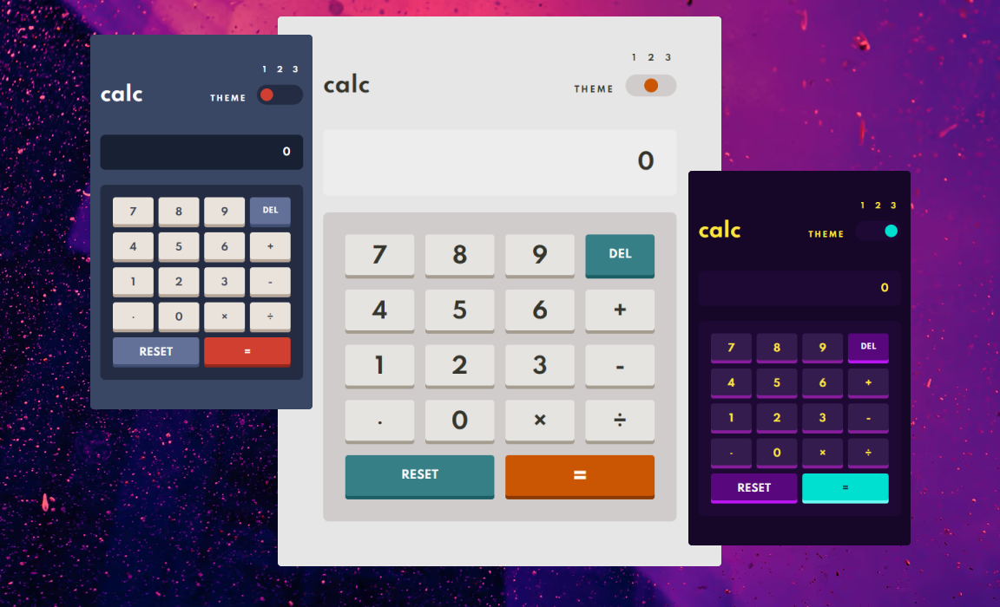

# Frontend Mentor - Calculator app solution

This is a solution to the [Calculator app challenge on Frontend Mentor](https://www.frontendmentor.io/challenges/calculator-app-9lteq5N29).

## Table of contents

- [Overview](#overview)
  - [The challenge](#the-challenge)
  - [Screenshot](#screenshot)
  - [Links](#links)
- [My process](#my-process)
  - [Built with](#built-with)
  - [What I learned](#what-i-learned)
  - [Continued development](#continued-development)
  - [Useful resources](#useful-resources)
- [Author](#author)

## Overview

### The challenge

Users should be able to:

- See the size of the elements adjust based on their device's screen size
- Perform mathmatical operations like addition, subtraction, multiplication, and division
- Use keyboard as well as mouse
- Adjust the color theme based on their preference
- Have their initial theme preference checked using `prefers-color-scheme` and have any additional changes saved in the browser

### Screenshot

### Links

- Solution URL: [Add solution URL here](https://your-solution-url.com)
- Live Site URL: https://calculator-kappa-three.vercel.app/

## My process

### Built with

- React
- XState
- Vanilla Extract

### What I learned

With this challenge I wanted to dig into XState for managing the business logic. A calculator seemed a great choice to use a state machine as there are many events that are only valid while the app is in certain states.

XState has a bit of a learning curve, but I found it extremely useful for keeping all of the logic together and made it very easy to test. It effectively means the rest of the application is almost entirely presentational. The only other logic is for managing the user theme preferences.

I used TDD to build out the app, testing everything with React Testing Library. This made sure that both the logic in the state machine was correct, and that the UI was dispatching the correct events. The tests run fast, but if the app was to grow in complexity it would be easy to move the logic tests over to purely test the machine, and reserve the UI tests to just check the main flows.

Based on my experiences building this I would definitely use XState again for anything with complex stateful logic. Though I would consider it a bit overkill for something like a mostly CRUD app.

I also re-used a lot of the ideas of my simple design system from my previous project [Tip Calculator](https://github.com/AlexKMarshall/tip-calculator). This made the styling of the app very fast and I'm very pleased with the pay-off from the time invested in building it the first time.

### Continued development

The one thing I'd like to improve on a future project is managing multiple themes with static site generation. I've done it before with a simple light/dark toggle, but here with multiple themes, I did not implement a server-side default. So there may be a brief flash of incorrect theme before the user's preference can be read client side.

### Useful resources

- [Xstate Visualiser](https://stately.ai/viz) - Being able to see all of the connections in the state machine made it much easier to spot missing pieces

## Author

- Website - [Alex Marshall](https://github.com/AlexKMarshall)
- Frontend Mentor - [@AlexKMarshall](https://www.frontendmentor.io/profile/AlexKMarshall)
- Twitter - [@AlexKMarshall1](https://twitter.com/alexkmarshall1)
